# 👋 Hi there, I'm Chanupa! (@Chanu23UOM)

  

Welcome to my GitHub profile! I'm an Electrical Engineering student with a passion for building innovative hardware and software solutions. 

## 🚀 About Me
- 🔭 I’m currently working on **Electronic Projects, Electrical and Power Systems**
- 🌱 I’m currently learning **Advanced Microcontrollers and Machine Learning**
- 💬 Ask me about **Circuit Design, IoT, and Python**
- 📫 How to reach me: **[chanupahansajarcg2003@gmail.com / www.linkedin.com/in/chanupa-hansaja-vithanage]**

## 🛠️ Languages & Tools

  
  
  
  
  
  

## 📊 GitHub Stats & Contributions

  
  

  <h3>🐍 My GitHub Contribution Snake</h3>
  <!-- The snake animation will appear here once the GitHub Action runs -->
  <picture>
    <source media="(prefers-color-scheme: dark)" srcset="https://raw.githubusercontent.com/Chanu23UOM/Chanu23UOM/output/github-contribution-grid-snake-dark.svg">
    <source media="(prefers-color-scheme: light)" srcset="https://raw.githubusercontent.com/Chanu23UOM/Chanu23UOM/output/github-contribution-grid-snake.svg">
    
  </picture>

